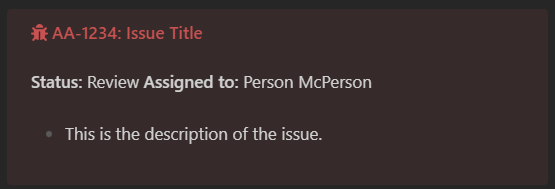

# Overview

Connect your Jira issues to Obsidian. Search for issues and them to frontmatter or use them in templates without leaving Obsidian. See the [project roadmap](https://github.com/users/OfficerHalf/projects/5) for details on the future of the plugin.

## Install

Install via the community plugin registry in Obsidian or via [this link](https://obsidian.md/plugins?id=jira-cloud). The plugin may also be installed using [BRAT](https://github.com/TfTHacker/obsidian42-brat).

## Getting started

See [configuration](configuration.md) for setup instructions.

This plugin currently only supports Obsidian commands and usage through the plugin's JavaScript API.

## Commands

### Insert issue link at cursor

Executing the command `Jira Cloud: Insert issue link at cursor` will open a modal where you can search for issues by key or summary title. After selecting an issue, a link to that issue will be added at the cursor in the current file. The link includes the key and issue summary, like `[AB-1234: Deploy the prototype before the deadline](https://your-company.atlassian.net/browse/AB-1234)`.

### Create new issue

Executing the command `Jira Cloud: Create new issue` will open a modal where you can specify an issue name, select a project, and select an issue type. The issue will be created and a link to the issue copied to the clipboard.

### Summarize to frontmatter

Executing the command `Jira Cloud: Summarize issue to frontmatter` will open a modal where you can search for issues by key or summary title. After selecting an issue, the following data will be added to the current note's YAML frontmatter:

```yaml
issues:
  - key: AA-1234
    summary: Issue Name
    link: https://your-company.atlassian.net/browse/AA-1234
    assignee: Person McPerson
    status: To-do
    reporter: Another Person
    created: 2023-07-01T13:57:38.686-0700
    updated: 2023-07-10T11:05:48.493-0700
    fullText: >-
      The full description of the issue as a single or multiline string.

      This example shows a multiline string.
```

Subsequent executions of the command will add to the issues object if a different issue is selected. If the same issue is selected, the values will be replaced.

### Add issue to frontmatter

Executing the command `Jira Cloud: Add issue to frontmatter` will open a modal where you can search for issues by key or summary title. After selected an issue, many fields will be added to the YAML frontmatter:

```yaml
issues:
  - key: AA-1234
    summary: Issue Name
    link: https://your-company.atlassian.net/browse/AA-1234
    issuetype:
      iconUrl: https://your-company.atlassian.net/rest/api/2/some_url/
      name: Bug
      subtask: false
    status:
      iconUrl: https://your-company.atlassian.net/images/icons/statuses/generic.png
      name: To-do
    assignee:
      emailAddress: person@company.com
      displayName: Person McPerson
      avatar: https://avatars.example.net/some_id/48
    reporter:
      displayName: Another Person
      avatar: https://avatars.example.net/some_id/48
    fullText: >-
      The full description of the issue as a single or multiline string.

      This example shows a multiline string.
    updated: 2023-07-10T11:05:48.493-0700
    created: 2023-07-07T13:57:38.686-0700
    priority:
      iconUrl: https://your-company.atlassian.net/images/icons/priorities/high.svg
      name: High
    project:
      name: Engineering
      key: AA
      avatar: https://your-company.atlassian.net/rest/api/3/some_url/
    labels: []
```

If the "include full API response in YAML frontmatter" setting is enabled, the data will be expanded further. Note that this will produce a very large result.

## JavaScript API

This plugin exposes an API that can be used with other plugins. It can be accessed via `app.plugins.plugins['jira-cloud'].api`. See the API class [here](https://github.com/OfficerHalf/obsidian-jira-cloud/blob/main/src/api.ts).

<!-- TODO: Update this example with the refactored issue api response type
For example, the following [Templater](https://github.com/SilentVoid13/Templater) template adds an issue inside a callout, with the callout type configured using the [Admonition](https://github.com/javalent/admonitions) plugin.

```markdown
<%* const issue = await app.plugins.plugins['jira-cloud'].api.getIssue() %>

> [!Issue<% issue.issuetype.name %>] <% `${issue.key}: ${issue.summary}` %>
> <% `**Status:** ${issue.status.name} **Assigned to:** ${issue.assignee.displayName}` %>
>
> <% issue.fullText.split('\n').join('\n> ') %>
```

This could produce a callout like this:



See [Examples](examples) for more examples of use.
-->

## Disclaimers

This plugin is open source software not created or endorsed in any way by Atlassian. It also makes use of other open source libraries, mainly [Jira.js](https://github.com/MrRefactoring/jira.js), which is similarly not created or endorsed by Atlassian.

Use of this plugin requires the creation of an API Token which grants full read and write access to the configured Jira instance; though it can be revoked at any time, anything your Jira account can do, this token can do. Use at your own risk.
